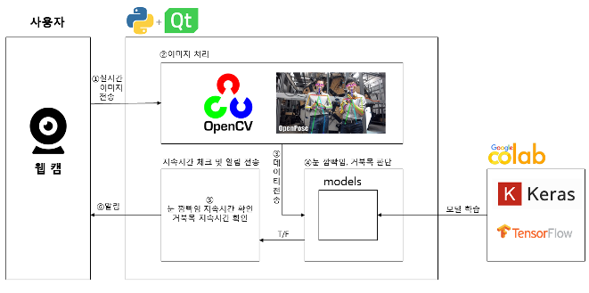

# 종합설계 11조

## 프로젝트 목표

웹 캠을 통해 사용자의 눈 깜빡임과 자세를 탐지하고 이에 대한 정보를 사용자에게 알리는 소프트웨어를 제작한다.

* 학습된 모델을 이용해 사용자의 눈 깜빡임을 탐지한다.
* 관절을 추적하여 사용자의 자세 이상을 탐지한다.
* 오랜 시간 눈을 깜빡이지 않거나 잘못된 자세를 유지할 경우 팝업 창을 이용해 사용자에게 경고 메시지를 보낸다.

## 사용 기술

* 개발 언어: python
* GUI 라이브러리: PyQt5
* 이미지 입력 및 처리: OpenCV
* 골격 탐지: OpenPose
* 모델 개발 및 학습: Google Colab, Jupyter Notebook, Keras


## 시스템 및 GUI 구성

### 시스템 구성



### GUI 구성


## 구동 영상


## 프로젝트 구조

```
hufs-11/
├── docs
├── resources (정적 파일)
        └── models (학습된 모델(*.h5))
├── src
    └── RabbitAndTurtle (메인 패키지, 각 파일의 용도는 파일 상단에 적어놨음)
            ├── __init__.py
            ├── controllers.py
            ├── images.py
            ├── models.py
            ├── statistics.py
            ├── user_settings.py
            └── views.py
├── tests
    └── __init__.py
├── README.md
├── requirements.txt (의존성)
└── setup.py (빌드 및 패키징 설정)
```